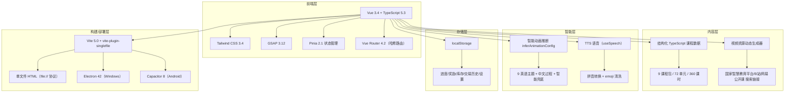
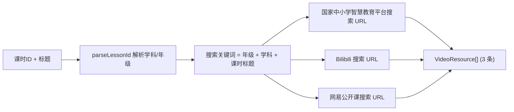
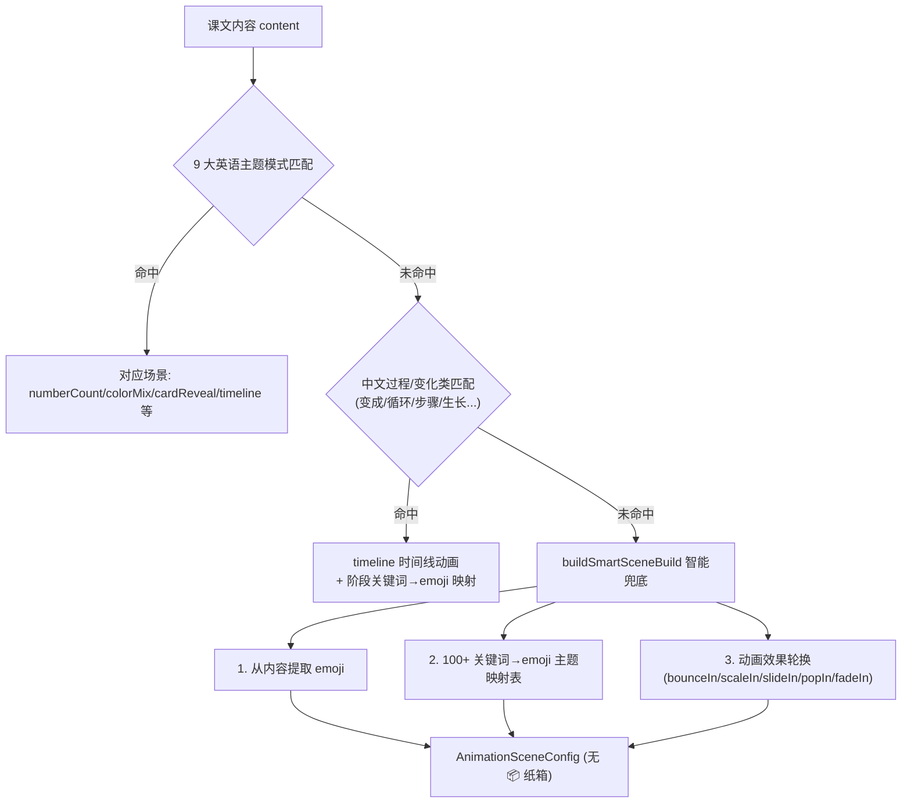
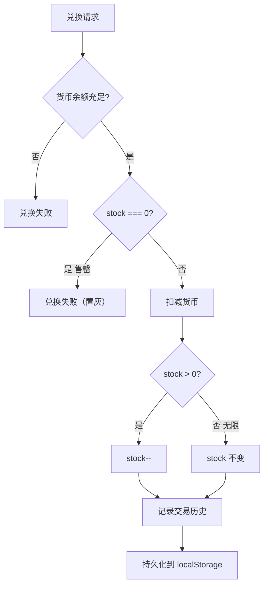
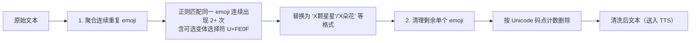

# 老田和小甜甜的游戏屋——技术架构文档

## 1. 架构设计



## 2. 技术描述

| 技术 | 版本 | 用途 |
|------|------|------|
| Vue 3 | 3.4 | 前端框架（组合式 API） |
| TypeScript | 5.3 | 类型安全 |
| Vite | 5.0 | 构建工具 |
| Pinia | 2.1 | 状态管理 |
| Vue Router | 4.2 | 路由（`file://` 协议下自动切换为 hash 模式） |
| GSAP | 3.12 | 动画引擎（含 ScrollTrigger） |
| Tailwind CSS | 3.4 | 样式系统 |
| vite-plugin-singlefile | 2.3 | 单文件打包，支持 `file://` 协议离线运行 |
| Electron | 42 | Windows 桌面打包（便携 EXE + NSIS 安装包） |
| Capacitor | 8 | Android 打包（可选） |

* **后端**：无（纯前端，数据存储在浏览器本地）
* **数据库**：localStorage（进度、奖励、库存、交易历史、设置全部本地持久化）
* **语音**：Web Speech API（系统自带 TTS，完全离线）

> 注：早期架构审核曾推荐 Nuxt3，但项目实际采用 **Vue 3 + Vite + Vue Router + Tailwind CSS + GSAP + Pinia** 方案，以支持单文件打包与 `file://` 协议离线运行。课程内容为结构化 TypeScript 数据文件（非 MDX），由 AI 按模板生成。

## 3. 路由定义

路由采用 `createWebHashHistory`，在 `file://` 协议下自动启用哈希模式，避免刷新 404。

| 路由                                       | 用途             |
| ---------------------------------------- | -------------- |
| `/`                                      | 首页：学习冒险地图+今日任务 |
| `/courses`                               | 课程浏览：学科选择      |
| `/courses/:subject`                      | 学科详情：年级列表      |
| `/courses/:subject/:grade`               | 年级详情：单元列表      |
| `/courses/:subject/:grade/:unit`         | 单元详情：课时列表      |
| `/courses/:subject/:grade/:unit/:lesson` | 课时学习页（核心页面）    |
| `/rewards`                               | 奖励中心           |
| `/review`                                | 复习中心           |
| `/parent`                                | 家长仪表盘          |

## 4. 数据模型

### 4.1 核心类型定义

```typescript
// 课程元数据
interface CourseMeta {
  subject: 'math' | 'chinese' | 'english'
  grade: 1 | 2 | 3
  title: string
  totalUnits: number
}

// 单元数据
interface Unit {
  id: string
  title: string
  subtitle: string
  lessons: Lesson[]
}

// 课时数据
interface Lesson {
  id: string               // 格式: m1u2l3 (数学一年级第2单元第3课)
  title: string
  teachingMethod: string
  scenes: Scene[]
  practice: PracticeSet
  animations: AnimationSpec[]
  images: ImageSpec[]
}

// 学习进度
interface LessonProgress {
  lessonId: string
  status: 'locked' | 'in_progress' | 'completed'
  starLevel: 0 | 1 | 2 | 3
  accuracy: number
  completedAt: string | null
}

// 奖励记录
interface RewardRecord {
  type: 'star' | 'diamond' | 'badge'
  id: string
  name: string
  earnedAt: string
}

// 视频资源（动态生成）
interface VideoResource {
  id: string
  title: string
  platform: 'smartedu' | 'bilibili' | 'netease' | 'other'
  url: string           // 搜索链接（非直链）
  searchUrl: string
  keywords: string[]
  duration: string
  matchScore: number
  note: string
}

// 心愿商店商品（含库存）
interface WishItem {
  id: string
  name: string
  description: string
  starCost: number
  icon: string
  stock: number         // -1=无限, 0=售罄, >0=可兑换数量
  purchased: boolean
  custom?: boolean
}

// 钻石商店商品（含库存）
interface DiamondItem {
  id: string
  name: string
  description: string
  diamondCost: number
  icon: string
  stock: number         // -1=无限, 0=售罄, >0=可兑换数量
  purchased: boolean
  custom?: boolean
}
```

### 4.2 存储架构

* **localStorage**：当前课程 ID、用户设置、临时状态、所有课时进度、答题记录、奖励历史、库存与交易历史、复习队列、每日日志
* **持久化策略**：Pinia store 在初始化时从 localStorage 读取，状态变更时写回；旧数据自动迁移（无 `stock` 字段的商品按已购状态补默认库存）

## 5. 项目目录结构

```
star-land/
├── electron/main.cjs              # Electron 主进程
├── capacitor.config.ts            # Capacitor Android 配置
├── index.html                     # 入口（标题：老田和小甜甜的游戏屋）
├── src/
│   ├── pages/                     # 9 个页面
│   │   ├── HomePage.vue           # 首页（签到+学科入口）
│   │   ├── LessonPage.vue         # 课时学习页（核心）
│   │   ├── RewardsPage.vue        # 奖励中心（心愿商店+钻石商店+库存）
│   │   └── ParentPage.vue         # 家长中心
│   ├── components/animation/      # 动画组件
│   │   ├── LessonAnimation.vue    # 通用动画场景
│   │   ├── CPAStage.vue           # CPA 教学法动画
│   │   └── ContentBlockRenderer.vue # 内容块渲染器（含智能动画推断 inferAnimationConfig）
│   ├── data/                      # 课程数据（~29,000 行）
│   │   ├── math/                  # 数学 120 课时
│   │   ├── chinese/               # 语文 120 课时
│   │   ├── english/               # 英语 120 课时
│   │   ├── videoDirectLinks.ts    # 视频资源动态生成（搜索链接）
│   │   └── videoResourceGenerator.ts # 视频资源生成器（回退方案）
│   ├── stores/                    # Pinia 状态管理
│   │   ├── course.ts              # 课程数据
│   │   ├── progress.ts            # 学习进度（持久化）
│   │   ├── reward.ts              # 奖励/成就/心愿/钻石商店（含库存系统，持久化）
│   │   └── settings.ts            # 设置（含语音速度+孩子名字）
│   └── composables/               # 组合式函数
│       ├── useSpeech.ts           # TTS 语音（含拼音转换+emoji 清洗 cleanEmojiForTTS）
│       └── useGsap.ts             # GSAP 动画封装
└── package.json
```

## 6. 视频资源动态生成架构

### 6.1 设计理念

取代早期 360 条易失效的硬编码直链，改为根据课时信息动态生成搜索链接。搜索链接稳定可靠，不会因单个视频下架而失效。

### 6.2 生成流程



### 6.3 实现细节（`src/data/videoDirectLinks.ts`）

* **课时 ID 解析**：`parseLessonId` 用正则 `^([mce])(\d)u\d+l\d+$` 解析课时 ID（如 `m1u2l3` → 数学一年级第 2 单元第 3 课）
* **三个渠道的 URL 构造**：
  - 国家中小学智慧教育平台：`https://www.zxx.edu.cn/syncResource/search?keyword=...`（教育部官方，免费，最权威）
  - Bilibili：`https://search.bilibili.com/all?keyword=...&order=totalrank`（内容丰富，名师讲解与动画）
  - 网易公开课：`https://open.163.com/newview/search?keyword=...`（免费系统课程）
* **关键词**：`encodeURIComponent(年级 + 学科 + 课时标题)`，确保精准匹配对应课程
* **回退方案**（`videoResourceGenerator.ts`）：当 `getDirectLinkResource` 返回空时，回退到网易公开课搜索页

## 7. 智能动画推断系统架构

### 7.1 设计理念

`inferAnimationConfig`（位于 `ContentBlockRenderer.vue`）根据课文内容自动选择最合适的 14 种动画场景之一，消除早期统一的 📦 纸箱占位符。

### 7.2 推断流程



### 7.3 模式匹配器清单

| # | 匹配器 | 触发关键词（示例） | 输出场景 |
|---|--------|-------------------|----------|
| 1 | 数字（阿拉伯） | 1-10 + 数字/count | numberCount |
| 2 | 数字（英文单词） | one~ten + number/count | numberCount |
| 3 | 合并/加法 | 合并/加 + emoji 提取 | numberMerge |
| 4 | 分离/减法 | 分离/减 + emoji 提取 | numberSeparate |
| 5 | 字母 | alphabet/letters/ABC | cardReveal（字母卡） |
| 6 | 颜色 | red/blue/green... + color | colorMix |
| 7 | 问候 | hello/hi/good morning | cardReveal（问候卡） |
| 8 | 家庭 | father/mother/family | timeline（家庭成员 emoji） |
| 9 | 动物 | cat/dog/bird... | timeline（动物 emoji） |
| 10 | 水果 | apple/banana/grape... | timeline（水果 emoji） |
| 11 | 身体部位 | head/hand/eye... | timeline（身体 emoji） |
| 12 | 日常动作 | get up/brush/eat... | timeline（动作 emoji） |
| 13 | 中文过程/变化 | 变成/循环/步骤/生长/蒸发... | timeline（阶段关键词→emoji，50+ 映射） |
| 14 | 智能兜底 | 默认 | buildSmartSceneBuild（emoji 提取 + 100+ 主题映射 + 效果轮换） |

### 7.4 智能兜底 `buildSmartSceneBuild`

1. **emoji 提取**：用正则 `[\u{1F300}-\u{1F9FF}\u{2600}-\u{27BF}\u{2B00}-\u{2BFF}]` 直接从内容提取 emoji
2. **关键词→emoji 主题映射**：100+ 条映射（学校→🏫、书→📚、朋友→👫、猫→🐱、苹果→🍎 等）
3. **动画效果轮换**：bounceIn / scaleIn / slideIn / popIn / fadeIn，避免视觉单调
4. **不再使用 📦 纸箱**：改用 ✨ 或提取到的主题 emoji

## 8. 库存经济系统设计

### 8.1 数据模型

`WishItem` 与 `DiamondItem` 均含 `stock` 字段：

| stock 值 | 含义 | UI 表现 |
|----------|------|---------|
| `-1` | 无限库存 | 正常可兑换 |
| `0` | 售罄 | 置灰、不可点击 |
| `>0` | 可兑换数量 | 显示库存徽标，兑换后递减 |

### 8.2 兑换流程（`src/stores/reward.ts`）



### 8.3 家长管理（PIN 验证）

家长凭 PIN 验证后可执行：
* **新增商品**：`addWishItem` / `addDiamondItem`（默认 stock=3）
* **编辑商品**：`updateWishItem` / `updateDiamondItem`（可改 name/description/cost/icon/stock）
* **补货**：`restockWishItem` / `restockDiamondItem`（直接设置 stock 值）
* **手动加星/加钻石**：`addStarsManually` / `addDiamondsManually`（需 PIN 验证）

### 8.4 交易历史与迁移

* **交易历史**：星星变动历史 + 钻石变动历史，持久化到 localStorage
* **向后兼容迁移**：初始化时检测旧数据，无 `stock` 字段的商品按 `purchased ? 0 : 5`（心愿商店）/ `purchased ? 0 : 3`（钻石商店）补默认库存

## 9. TTS emoji 清洗实现

### 9.1 问题

课文内容常含连续 emoji（如 ⭐⭐⭐⭐⭐），若不处理，TTS 会逐个朗读或读成乱码，严重影响体验。

### 9.2 实现（`src/composables/useSpeech.ts` 的 `cleanEmojiForTTS`）



### 9.3 关键技术点

* **正则覆盖范围**：`\u{1F300}-\u{1F9FF}`（emoji 主区）+ `\u{2600}-\u{27BF}`（杂项符号）+ **`\u{2B00}-\u{2BFF}`（杂项符号和箭头，含 ⭐ U+2B50）**
* **变体选择符处理**：emoji 后常跟 `U+FE0F`（变体选择符 16），正则中用 `\u{FE0F}?` 可选匹配，避免漏匹配
* **按 Unicode 码点计数**：使用 `u` 标志的正则按码点而非 UTF-16 码元匹配，正确处理代理对
* **聚合格式**：连续重复的同一 emoji 聚合为"X颗星星""X朵花"等自然语言格式，避免 TTS 逐个朗读
* **示例**：`⭐⭐⭐⭐⭐` → "5颗星星"，`🌸🌸🌸` → "3朵花"

## 10. 14 种动画场景类型

| 场景类型 | 适用学科 | 说明 |
|----------|----------|------|
| numberCount | 数学 | 数数动画 |
| numberMerge | 数学 | 合并/加法 |
| numberSeparate | 数学 | 分离/减法 |
| verticalCalculation | 数学 | 竖式计算 |
| makeTen | 数学 | 凑十法 |
| cpaTransition | 数学 | CPA 过渡（具象→图示→抽象） |
| comparison | 数学 | 比较 |
| shapeDraw | 数学 | 图形绘制 |
| pinyinReveal | 语文 | 拼音揭示 |
| cardReveal | 语文/英语 | 卡牌揭示 |
| colorMix | 英语 | 颜色混合 |
| sceneBuild | 英语 | 场景构建 |
| timeline | 通用 | 时间线（过程/变化/日常动作） |
| celebration | 通用 | 庆祝纸屑 |

## 11. 跨平台与离线策略

* **单文件打包**：`vite-plugin-singlefile` 将所有 JS/CSS 内联到单个 HTML，支持 `file://` 协议双击打开
* **哈希路由**：`createWebHashHistory` 在 `file://` 协议下自动启用，避免刷新 404
* **Electron 打包**：`vite build --base=./` + `electron-builder`，输出 Windows 便携 EXE 与 NSIS 安装包
* **Capacitor 打包**：`vite build --base=./` + `npx cap sync android`，输出 Android APK
* **语音离线**：Web Speech API 使用系统自带 TTS，无需联网
* **数据本地化**：所有数据存储在 localStorage，隐私安全，无需后端服务
