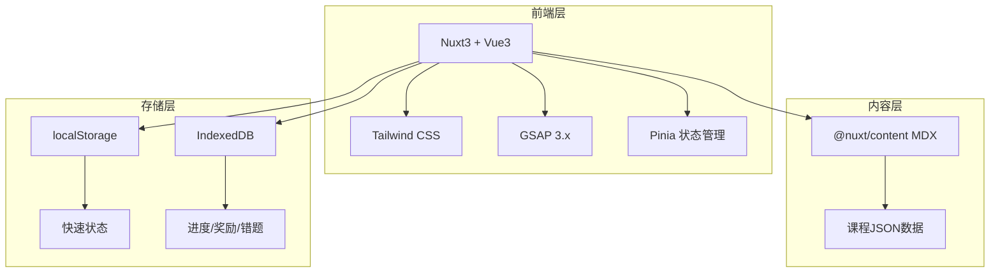

# 星知大陆——技术架构文档

## 1. 架构设计



## 2. 技术描述

* **前端框架**：Vue3 + Nuxt3（约定式路由天然匹配课程层级结构）

* **样式系统**：Tailwind CSS 3.x

* **动画引擎**：GSAP 3.x（含ScrollTrigger）

* **状态管理**：Pinia

* **内容管理**：@nuxt/content（MDX驱动课程内容）

* **初始化工具**：npx nuxi\@latest init

* **后端**：无（纯前端，数据存储在浏览器本地）

* **数据库**：IndexedDB（结构化数据）+ localStorage（快速状态）

> 注：虽然技术架构审核推荐Nuxt3，但web-dev技能模板仅支持Vue3+Vite。考虑到项目实际需求，采用 **Vue3 + Vite + Vue Router + Tailwind CSS + GSAP + Pinia** 方案，这是Nuxt3的底层技术栈，后续可平滑迁移至Nuxt3。

## 3. 路由定义

| 路由                                       | 用途             |
| ---------------------------------------- | -------------- |
| `/`                                      | 首页：学习冒险地图+今日任务 |
| `/courses`                               | 课程浏览：学科选择      |
| `/courses/:subject`                      | 学科详情：年级列表      |
| `/courses/:subject/:grade`               | 年级详情：单元列表      |
| `/courses/:subject/:grade/:unit`         | 单元详情：课时列表      |
| `/courses/:subject/:grade/:unit/:lesson` | 课时学习页（核心页面）    |
| `/rewards`                               | 奖励中心           |
| `/review`                                | 复习中心           |
| `/parent`                                | 家长仪表盘          |

## 4. 数据模型

### 4.1 核心类型定义

```typescript
// 课程元数据
interface CourseMeta {
  subject: 'math' | 'chinese' | 'english'
  grade: 1 | 2 | 3
  title: string
  totalUnits: number
}

// 单元数据
interface Unit {
  id: string
  title: string
  subtitle: string
  lessons: Lesson[]
}

// 课时数据
interface Lesson {
  id: string
  title: string
  teachingMethod: string
  scenes: Scene[]
  practice: PracticeSet
  animations: AnimationSpec[]
  images: ImageSpec[]
}

// 学习进度
interface LessonProgress {
  lessonId: string
  status: 'locked' | 'in_progress' | 'completed'
  starLevel: 0 | 1 | 2 | 3
  accuracy: number
  completedAt: string | null
}

// 奖励记录
interface RewardRecord {
  type: 'star' | 'diamond' | 'badge'
  id: string
  name: string
  earnedAt: string
}
```

### 4.2 存储架构

* **localStorage**：当前课程ID、用户设置、临时状态

* **IndexedDB**：所有课时进度、答题记录、奖励历史、复习队列、每日日志

## 5. 项目目录结构

```
src/
├── assets/css/tailwind.css
├── components/
│   ├── course/          # 课程通用组件
│   │   ├── CourseCard.vue
│   │   ├── UnitProgress.vue
│   │   ├── LessonNav.vue
│   │   └── StarRating.vue
│   ├── interactive/     # 互动组件
│   │   ├── FlashCard.vue
│   │   ├── QuizQuestion.vue
│   │   └── Timer.vue
│   ├── animation/       # GSAP动画组件
│   │   ├── CpaTransition.vue
│   │   ├── RewardAnimation.vue
│   │   └── FeedbackEffect.vue
│   ├── parent/          # 家长端组件
│   │   ├── ParentPanel.vue
│   │   └── TeachingGuide.vue
│   └── reward/          # 奖励系统组件
│       ├── StarCollector.vue
│       ├── BadgeShowcase.vue
│       └── AdventureMap.vue
├── composables/         # 组合式函数
│   ├── useGsap.ts
│   ├── useCourseProgress.ts
│   ├── useRewardSystem.ts
│   └── useParentMode.ts
├── pages/               # 页面组件
│   ├── HomePage.vue
│   ├── CoursesPage.vue
│   ├── SubjectPage.vue
│   ├── GradePage.vue
│   ├── UnitPage.vue
│   ├── LessonPage.vue
│   ├── RewardsPage.vue
│   ├── ReviewPage.vue
│   └── ParentPage.vue
├── stores/              # Pinia状态
│   ├── course.ts
│   ├── progress.ts
│   └── reward.ts
├── data/                # 课程数据
│   ├── math/
│   ├── chinese/
│   └── english/
├── types/               # TypeScript类型
│   └── index.ts
├── utils/               # 工具函数
│   ├── spacedRepetition.ts
│   └── courseParser.ts
├── App.vue
├── main.ts
└── router.ts
```

