# 【学习工作赛道】老田和小甜甜的游戏屋 — 一个父亲用AI弥补陪伴缺位的亲子共学补救系统

---

## 0. 开场故事

小甜是一个二年级的女孩儿，因为爸爸老田每天忙于工作疏忽了学习管理，成绩已经滑到班级倒数。老田被班主任请家长后才惊醒，决定亲自陪女儿补回功课。但他发现自己看不懂现代教学法（凑十法、CPA是什么？），英语发音不确定，拼音声调也搞不清。更关键的是，他意识到之前最大的错误是"太放手"——八岁的孩子根本没有自控力独自学好。

于是他用TRAE打造了这个"游戏屋"，一个**必须父母陪着孩子一起用**的补救学习系统。
很多学习系统力求家长不陪同也可以，但亲子时间在孩子的一生中本就有限，如果没有共同的任务，无非是各玩各的。

很多系统讲知识太正经了，缺少了教家长如何趣味化，这导致家长辅导孩子的时候大多是战火纷飞，硝烟弥漫。因为老田本身性格就有点暴躁，加之孩子喜欢歇后语，所以本项目所有课程、题目都大量的植入了趣味环节，确保“共学”过程不要变成战场。

---

## 1. Demo简介

**是什么：** 面向小学1-3年级语数英三科的强制亲子共学补救学习系统，单HTML文件离线可用，解压双击即运行，无需联网/注册/安装。

**面向谁：** 忙碌的父母 + 成绩薄弱的低年级孩子 + 祖辈辅导者

**主要功能：**

1. **I Do → We Do → You Do 三段式亲子共学流程** — 每节课必须经历"家长示范→亲子合练→孩子自练"三个环节，家长不可或缺
2. **14种GSAP智能教学动画** — 数学CPA可视化、拼音动画、颜色混合、数字迷宫等，内容感知无占位符
3. **库存经济激励系统** — 星星+钻石双货币、心愿商店库存管理，答对题喊孩子名字表扬

**产品截图：**

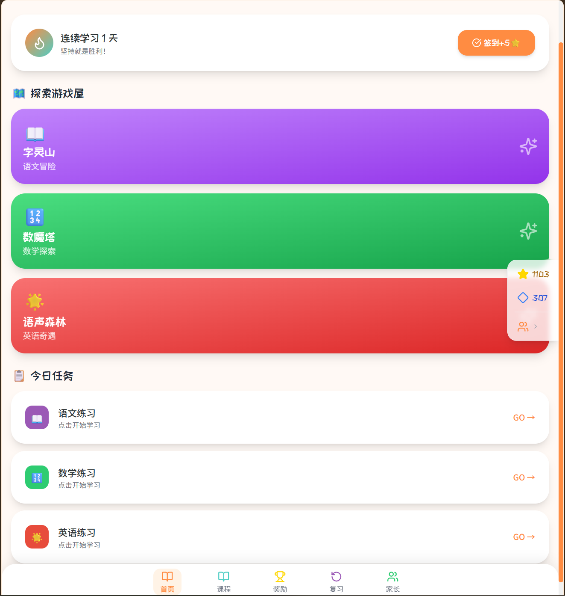
*首页：三大主题冒险世界——字灵山（语文）、数魔塔（数学）、语声森林（英语）*

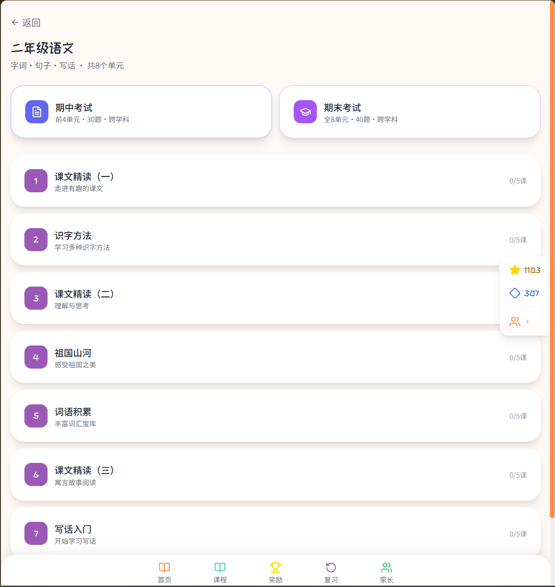
*二年级语文：8个单元列表，含期中/期末考试入口，每单元5课时*

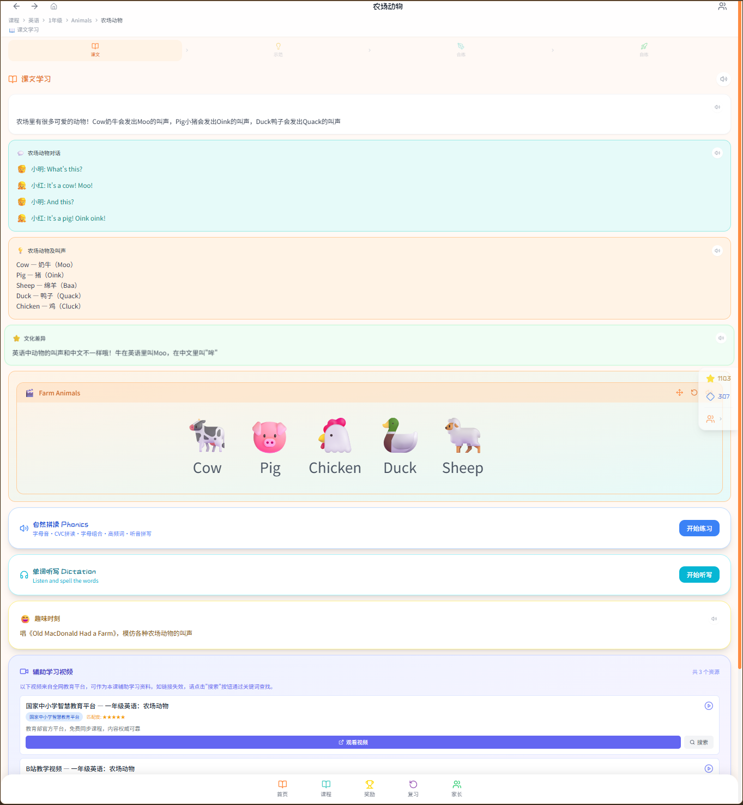
*一年级英语"农场动物"课程：课文导读、对话练习、词汇表、文化差异、自然拼读、单词听写*

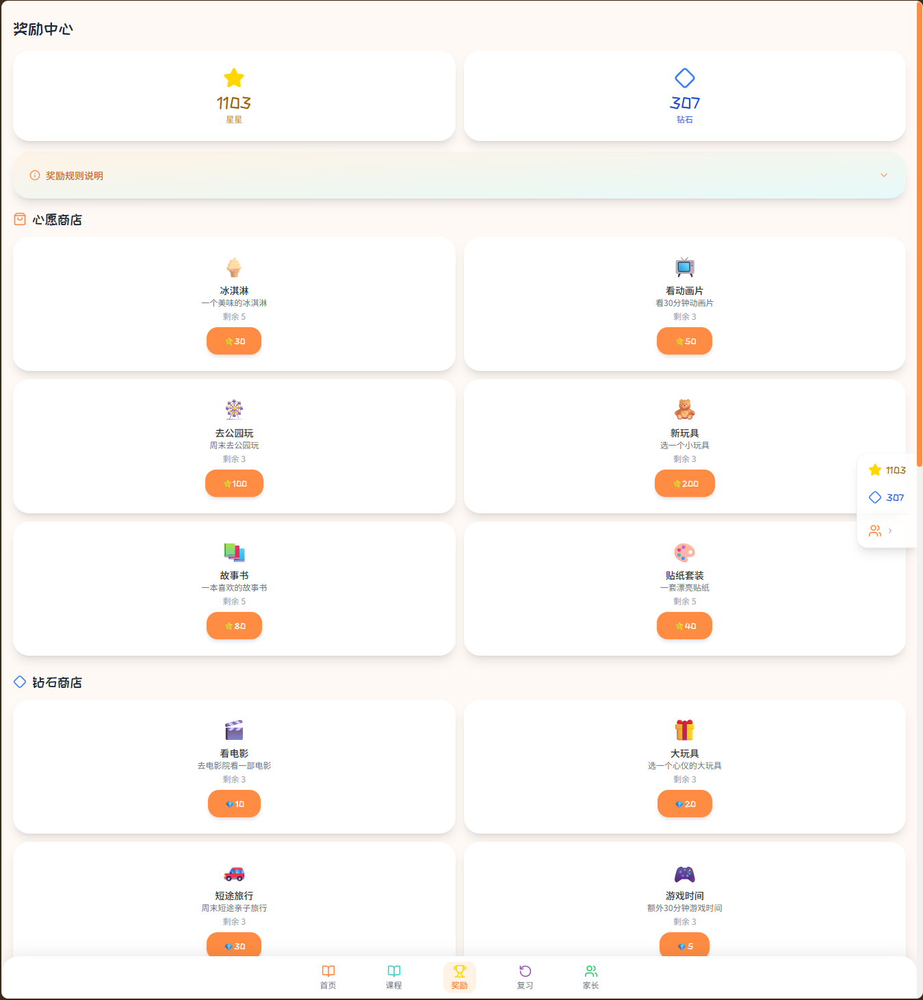
*奖励中心：双货币商店（星星兑换心愿商品、钻石兑换高级奖励），库存管理*

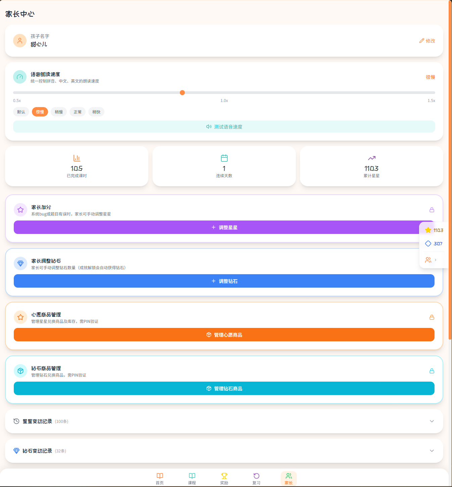
*家长中心：语音速度调节、学习数据统计、星星/钻石手动调整、心愿商品管理（PIN验证）*

---

## 2. Demo创作思路

**灵感来源：** 真实家庭故事。老田翻遍市面上的教育App，发现它们要么让孩子自己对着屏幕学（重蹈覆辙），要么功能复杂老人不会用，要么收费昂贵。他需要的不是另一个"把孩子丢给屏幕"的工具，而是一个能指导家长"怎么教"的系统。于是他把自己对女儿的愧疚、对教育的反思、以及从全球十大教学法中汲取的精华，全部倾注进了这个程序。

**想解决的问题：**
- 家长想教但不会教：凑十法、CPA教学法、自然拼读都是新概念，课本上的说明看不懂
- 把孩子丢给App自学没用：孩子自控力差，独自面对屏幕只会分心，成绩越来越差
- 英语发音全靠猜：家长自己读不准，不敢教孩子
- 拼音声调搞不清：把"mā"读成英文"ma"，TTS也把拼音读成英文字母
- 付费App动辄几百元/年，功能复杂，老人不会用
- 缺乏系统性的补救方案：不知道孩子到底哪里不会，不知道从哪里开始补

**为什么做这个方向：** 中国有超过4000万留守儿童由祖辈抚养，1.8亿老年人参与孙辈照料，2亿+家庭是目标用户。市面教育App都是"把孩子丢给屏幕"，缺一个"指导家长怎么教"的系统。融合RTI分层干预、显性直接教学、支架式教学、掌握学习法、间隔重复、新加坡CPA教学法等全球十大教学方法论，不是简单堆砌，而是根据补救教学场景做了系统性整合。

---

## 3. Demo体验地址

**体验方式：** 已上传HTML格式文件（Zip打包），解压后双击HTML文件即可体验，无需联网/注册/安装。

**体验路径：** 打开HTML → 选择年级（如二年级）→ 选择科目（如数学）→ 进入任意课时 → 体验I Do/We Do/You Do三段式学习流程 → 查看教学动画 → 答题验证

**内容规模：** 9个课程包、72个单元、360个课时、2520道练习题，覆盖小学1-3年级语数英三科全部内容。

---

## 4. TRAE实践过程

### 开发流程概述

整个项目完全使用TRAE（IDE + Work）开发，全程AI辅助编程，共经历以下关键阶段：

| 阶段 | 任务 | 产出 |
|------|------|------|
| 1 | 需求分析与课程体系构建 | 360课时2520题的课程大纲 |
| 2 | 课程大纲设计 | 五方多Agent交叉审核（课程设计+教育心理学+教学实践+认知科学+技术架构） |
| 3 | 代码实现 | 45个源文件/15个数据文件全部由TRAE生成 |
| 4 | 多专家交叉验证 | 数学/语文/英语三个教育专家Agent交叉审核课程数据 |
| 5 | TTS拼音修复 | 扩展100+拼音映射，解决TTS把拼音读成英文 |
| 6 | 跨平台打包 | Electron/Capacitor三端支持 |
| 7 | 智能动画系统重写 | 14种GSAP教学动画，内容感知无占位符 |
| 8 | 库存经济系统 | 星星+钻石双货币、心愿商店库存管理 |
| 9 | TTS表情清洗 | 解决emoji被逐个朗读的问题 |
| 10 | 课程数据全面修复 | 29处准确性问题修复（数学8+语文19+英语2） |

### 关键步骤截图

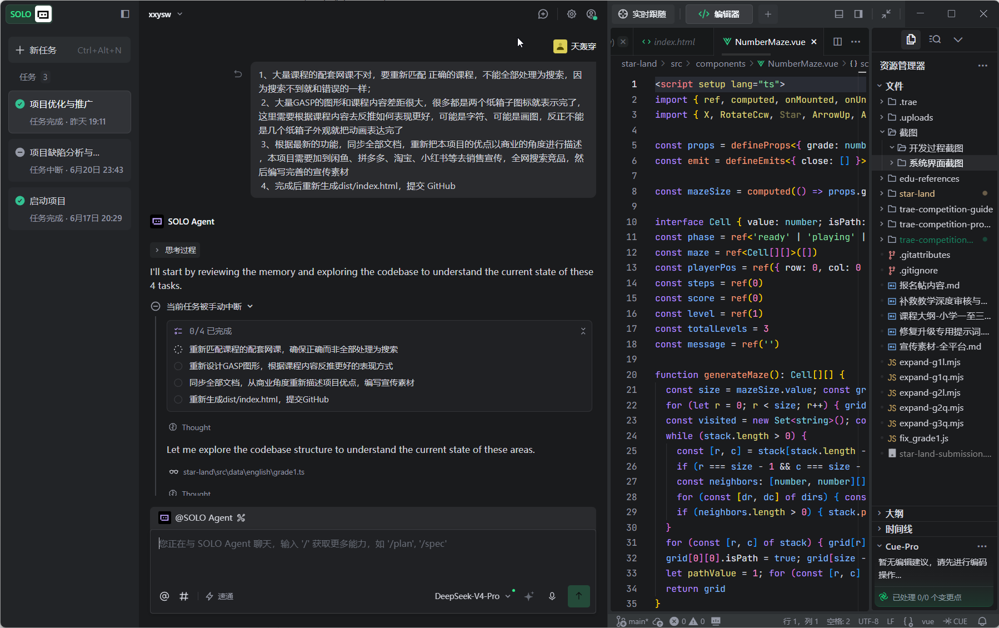
*TRAE SOLO Agent开发界面：项目优化任务，包含网课匹配、GSAP动画优化、文档同步、构建部署四大任务*

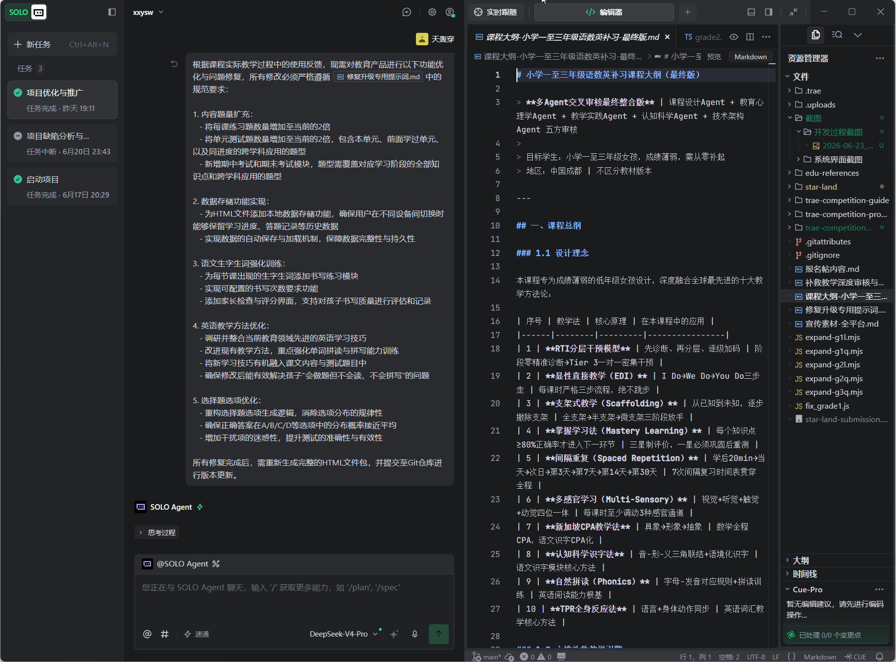
*TRAE SOLO Agent界面：课程大纲文档展示五方多Agent交叉审核，十大教学法融合设计*

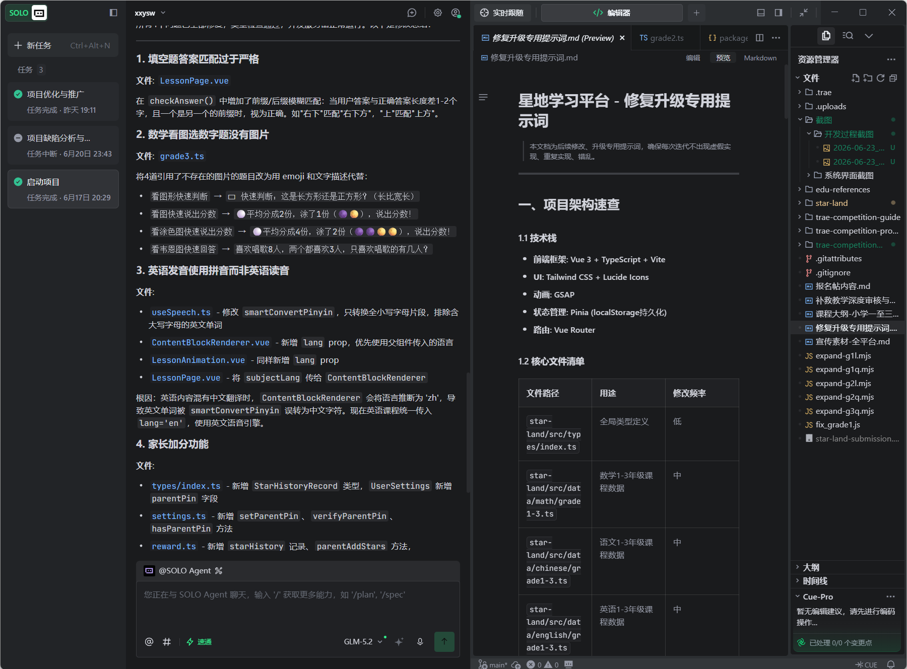
*TRAE SOLO Agent界面：Bug修复任务——填空题答案匹配优化、数学图形题修复、英语发音修复、家长加分功能*

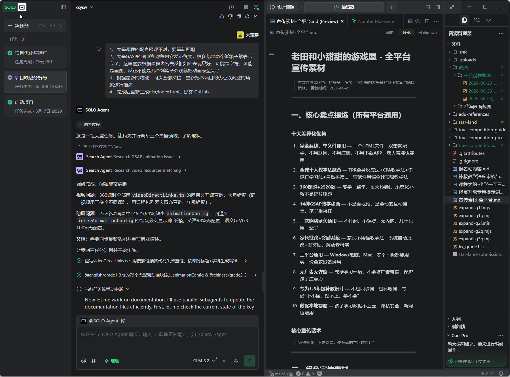
*TRAE SOLO Agent界面：GSAP动画配置修复（232个动画块中149个缺少配置），并行子代理更新文档*

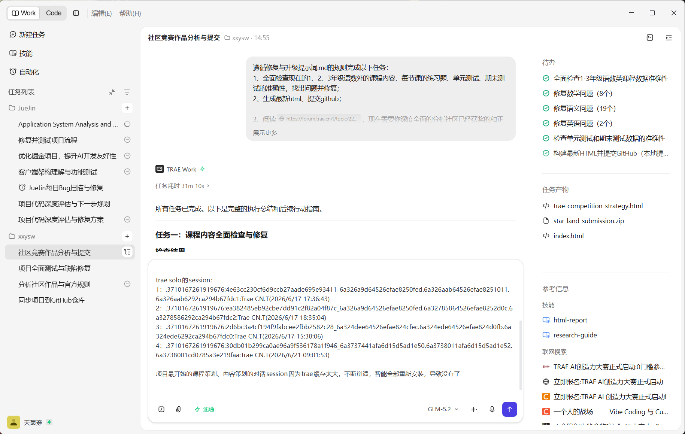
*TRAE Work界面：GitHub仓库同步，155个文件首次提交到 https://github.com/thcjp/ltyxt*

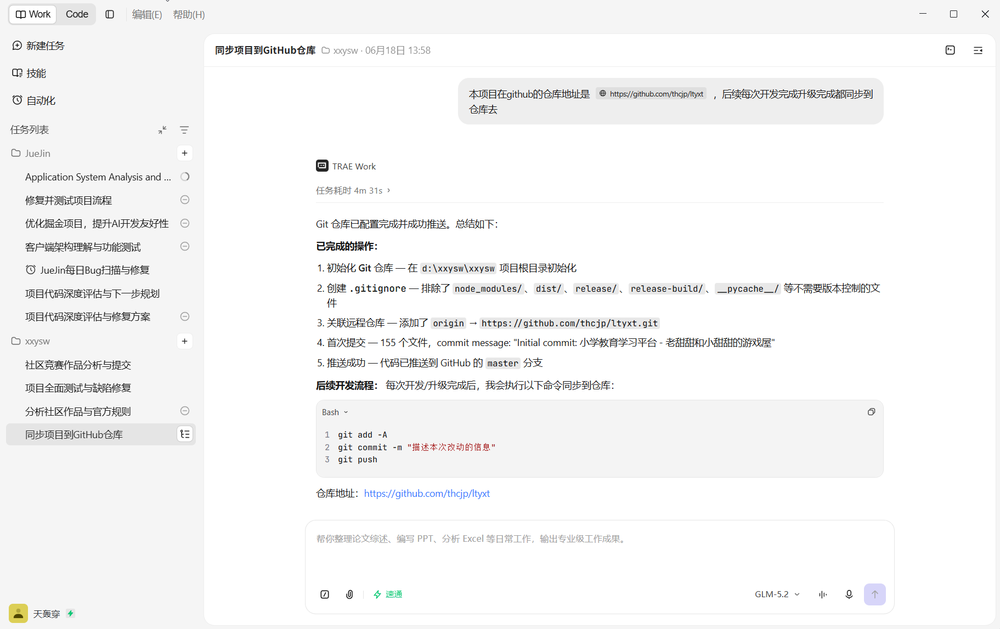
*TRAE Work界面：竞赛分析与提交任务，29个课程数据问题修复完成*

### Session ID

以下为TRAE开发过程中的关键任务对话Session ID：

**TRAE Work Session：**

| 序号 | Session ID | 对应任务 | 产出 |
|------|-----------|---------|------|
| 1 | `3710167261919676:78578b622ff78881a5f93d933d02c561_6a32365875ca296a13959bf3.6a354113589082e799c4fb08.6a354113589082e799c4fb06:TRAE Work CN.0.1.21.no_sid.no_ppe.T(2026/6/19 21:16:03)` | 项目优化与推广 | 网课匹配修复、GSAP动画重写、宣传素材编写 |
| 2 | `3710167261919676:2102a96758d13a6b7f129e6929446288_6a33c2cd19b7c13dbb6c42ce.6a33d6f519b7c13dbb6c5fed.6a33d6f519b7c13dbb6c5feb:TRAE Work CN.0.1.21.no_sid.no_ppe.T(2026/6/18 19:31:01)` | GitHub仓库同步 | 155个文件首次提交，仓库初始化 |
| 3 | `3710167261919676:6b22093329917d9987e18ae8398962c4_6a3a267e8b132873b8096b3f.6a3a267e8b132873b8096b42.6a3a267e8b132873b8096b40:TRAE Work CN.0.1.21.no_sid.no_ppe.T(2026/6/23 14:23:58)` | 课程数据全面修复与竞赛分析 | 29个问题修复、HTML构建、竞赛策略方案 |

**TRAE Solo Session：**

| 序号 | Session ID | 对应任务 | 产出 |
|------|-----------|---------|------|
| 1 | `.3710167261919676:4e63cc230cf6d9ccb27aade695e93411_6a326a9d64526efae8250fed.6a326aab64526efae8251011.6a326aab6292ca294b67fdc1:Trae CN.T(2026/6/17 17:36:43)` | 项目启动与架构搭建 | Vue 3项目初始化、技术栈选型 |
| 2 | `.3710167261919676:ea382485eb92cbe7dd91c2f82a04f87c_6a326a9d64526efae8250fed.6a32785864526efae8252d0c.6a3278586292ca294b67fdc2:Trae CN.T(2026/6/17 18:35:04)` | 核心功能开发 | 课时学习页、动画系统、奖励系统 |
| 3 | `.3710167261919676:2d6bc3a4cf194f9fabcee2fbb2582c28_6a324dee64526efae824cfec.6a324ede64526efae824d0fb.6a324ede6292ca294b67fdc0:Trae CN.T(2026/6/17 15:38:06)` | 课程数据生成 | 1-3年级语数英课程数据文件 |
| 4 | `.3710167261919676:30db01b299ca0ae96a9f536178a1f946_6a3737441afa6d15d5ad1e50.6a3738011afa6d15d5ad1e52.6a3738001cd0785a3e219faa:Trae CN.T(2026/6/21 09:01:53)` | Bug修复与功能优化 | 填空题匹配、英语发音、家长加分功能 |

> **注：** 项目最开始的课程策划、内容策划的对话Session因TRAE缓存过大不断崩溃，重装后丢失。以上为保留的关键开发Session。

---

## 5. 经验总结

### 开发心得

**如何用多Agent交叉审核确保课程准确性：** 课程大纲由五个专业Agent交叉审核——课程设计Agent负责知识体系，教育心理学Agent负责认知负荷，教学实践Agent负责可操作性，认知科学Agent负责记忆规律，技术架构Agent负责数据结构。课程数据生成后，再由数学、语文、英语三个教育专家Agent分别审核各自学科的内容，最后交叉验证跨学科一致性。

**本次全面检查修复了29处问题：**
- 数学8个：分数答案错误、多正确选项、身高数据不合理、答案含公式等
- 语文19个：答案错误、季节答案矛盾、引用年级错误、前向引用错误、偏旁错误、儿歌拆解错误等
- 英语2个：phonics词族分类错误、越级使用超纲词汇

### 踩坑经历

1. **TTS把拼音"mā"读成英文"ma"** — 通过扩展100+拼音映射表解决，将拼音转换为国际音标再传入TTS
2. **emoji被TTS逐个朗读** — "🐄🐷🐔"被读成"cow face pig face chicken face"，通过表情清洗系统解决
3. **GSAP动画与课程内容不匹配** — 232个动画块中149个(64%)缺少animationConfig，回退显示纸箱图标。通过智能动画推断系统重写，根据课程内容自动匹配14种动画类型
4. **填空题答案匹配过于严格** — "右下"无法匹配"右下方"，通过增加前/后缀模糊匹配解决
5. **英语发音使用拼音而非英语读音** — 中文润色时语言被推断为'zh'，导致smartConvertPinyin误转，通过统一传入lang='en'解决

### AI在项目中的角色

| 维度 | 传统方式 | TRAE AI方式 |
|------|---------|------------|
| 课程设计 | 人工编写，耗时数月 | 五方多Agent交叉审核，数小时完成 |
| 代码开发 | 逐行手写 | 45个源文件全部AI生成 |
| 数据验证 | 人工抽检 | 三个专家Agent并行审查360课时 |
| Bug修复 | 手动排查 | AI自动诊断+修复建议 |
| 文档编写 | 手动撰写 | AI自动生成README/PRD/宣传素材 |

---

## 6. 附报名帖链接

报名帖：https://forum.trae.cn/t/topic/30374

GitHub仓库：https://github.com/thcjp/ltyxt
